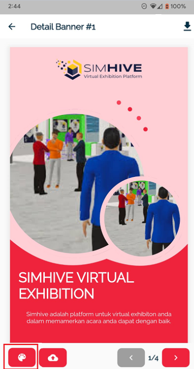

# Cara Penggunaan Aplikasi

## 1. Pengisian Email dan Password

Pertama silahkan untuk login terlebih dahulu , apabila belum mempunyai akun silahkan untuk menghubungi Event Organizer yang bersangkutan.

## 2. Melanjutkan login ke aplikasi

Setelah mengisi box yang disediakan dan login berhasil maka akan langsung diarahkan ke halaman beranda.

## 3. Membuat Design X-Banner

Pilih satu item design yang mau dibuat 
- Contoh : Memilih item design X-Banner 1 

*akan ditampilkan halaman seperti berikut.

*Keterangan pada gambar
- ada beberapa icon yang dapat diedit yaitu 
- Logo header untuk menambahkan logo
- dalam template ini terdapat 2 gambar yang dapat diubah
- Judul X-Banner 
- dan deskripsi dari X-Banner

## 4. Memasukkan Logo dan Gambar
Anda dapat memasukan logo dan gambar dengan klik box yang disediakan pada aplikasi.

#### Langkah 1 :
Menekan kotak merah yang ditunjukan seperti pada gambar, lalu anda akan diarahkan pada galeri device Anda.

#### Langkah 2 :

Pilih gambar yang tersedia dalam galeri device anda

#### Output
Pada keterangan gambar kali ini logo sudah berhasil diinputkan dan muncul pada item design X-Banner.

## 5. Mengubah Color Pallete
Anda dapat mengubah warna pada item design Anda dengan langkah beriku

#### Langkah 1 :
Sentuh box merah yang ada diposisi pojok kiri bawah tampilan aplikasi device Anda.

#### Langkah 2 :
Lalu akan muncul navigasi dengan pilihan beberapa warna, pilih salah satu untuk menerapkan warna yang Anda inginkan.

#### Output 
Pilihan warna yang anda pilih akan berubah seperti warna yang Anda inginkan.

## 6. Unduh Gambar
Aplikasi PictSnap terdapat fitur untuk mengunduh item design yang telah anda buat dengan langkah berikut.

#### Langkah 1:
Menekan tombol yang ada pada kota merah maka akan menyimpan item desain yang anda buat masuk ke dalam galeri Anda

#### Langkah 2 :
Aplikasi akan memberikan notifikasi apabila unduh berhasil, lalu untuk melihat hasilnya dapat pergi ke lihat banner.

#### Output 
Pada gambar dibawah diperlihatkan item desain yang sudah dibuat masuk ke dalam galeri device

## 7. Upload item design ke Virtual Booth Simhive
PictSnap Sendiri terintegrasi langsung dengan Virtual Booth pada SimHive dimana dapat mengunggah item desain melalui device mobile dengan cara berikut. 

#### Langkah 1 :
Anda dapat mengupload langsung item design langsung pada Virtual Booth dengan menyentuh icon pada berikut.

#### Output :
Pada gambar tertera diperlihatkan item desain yang sudah dibuat dapat masuk ke dalam Virtual Booth yang ada pada SimHive.

## 8. Pengecekan Virtual Booth pada SimHive
Untuk pengecekan apakah item desain sudah terunggah dapat dilakukan dengan langkah berikut.

#### Langkah 1 :
Buka web browser pada Desktop / PC Anda lalu ketik link ke event anda dan akses halaman login exhibitor melalui link yang didapatkan dari Event Organizer / Admin Event. 
Akses halaman login Exhibitor ditandai dengan alamat 

    "[Nama Domain Event]/exhibitor/login"
	
	Contoh :
	https://live3d.simhive.com/exhibitor/login

#### Langkah 2 : 
Anda akan diarahkan ke halaman web seperti berikut.

#### Langkah 3 :
Isikan Username dan Password dari akun SimHive yang didapat dari admin atau Event Organizer Anda.

#### Langkah 4 :
Anda akan diarahkan ke halaman dashboard seperti berikut.

#### Langkah 5 :
Arahkan kursor dan klik pada navigasi disamping dengan icon seperti berikut 

#### Output :
Pada halaman ini anda dapat melihat hasil dari item desain sudah terunggah pada Virtual Booth Anda.

