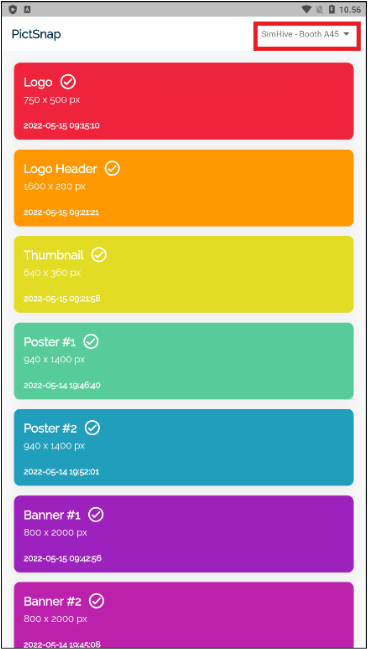

# PictSnap Mobile

Pada aplikasi ini Pengguna dapat menggunakan aplikasi desain visual booth yang ada pada SimHive.

## Beranda

Pada halaman ini akan user akan ditampilkan halaman utama dari aplikasi PictSnap seperti berikut.

### Penjelasan setiap item design
#### Dalam Virtual Booth sendiri yang disediakan pada SimHive Terdapat 7 Desain yang harus dipenuhi yaitu :

    1. X-Banner 1 
        Dimensi : 800 X 2000 pixel (Portrait
        maks ukuran : 500 KB
        tipe file : .jpg

    2. X-Banner 2 ( Khusus Booth Medium & Large)
        Dimensi  : 800 X 2000 Pixel (Portrait)
        maks ukuran : 500 KB
        tipe file : .jpg

    3.  Header Logo
        Dimensi : 1600 x 200 pixel (LandScape)
        maks ukuran : 300 KB
        tipe file : .jpg

    4.  Logo Meja 
        Dimensi : 750 x 500 pixel ( Landscape)
        maks ukuran : 300 KB
        tipe file : .jpg

    5.  Thumbnail Video 
        Dimensi : 640 x 360 pixel (Landscape) 
        maks ukuran : 500 KB
        tipe file : .jpg

    6.  Poster #1 
        Dimensi : 980 x 1400 pixel (portrait)
        maks ukuran : 500 KB
        tipe file : .jpg

    7.  Poster #2 
        Dimensi : 980 x 1400 pixel (portrait)
        maks ukuran : 500 KB
        tipe file : .jpg

##### *Keterangan gambar : 
pada kotak merah yang ditandai adalah nama anda sebagai User

##### *Keterangan : 
Pada kotak merah adalah item design yang dapat diedit oleh user untuk merancang desain dari Virtual Booth pada SimHive.

##### *Keterangan : 
Pada kotak merah adalah detail ukuran banner pada booth

## Detail Banner
Pada halaman ini user akan diperlihatkan halaman untuk dapat mengedit dari desain booth yang akan dipakai.

##### *Keterangan : 
Pada kotak merah yang ditandai adalah variasi dari template yang disediakan oleh aplikasi yang bisa digunakan oleh user.

##### *Keterangan : 
Pada kotak merah yang ditandai adalah tombol untuk mengganti warna pada desain banner yang akan digunakan.

##### *Sebelum 
Pada gambar berikut akan ditampilkan sebelum adanya diberi perubahan warna pada satu item design.

##### *Sesudah :
Pada gambar berikut akan ditampilkan perubahan setelah mengganti warna pada item design.

##### *Keterangan : 
Pada kotak merah yang ditandai adalah tombol untuk mengunduh gambar yang sudah didesain dan akan tersimpan didevice Anda.

